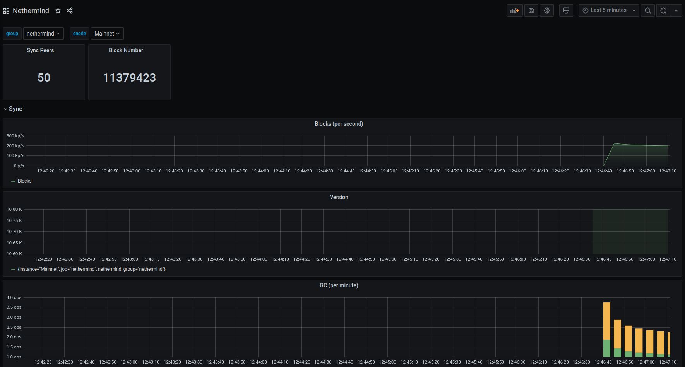

# ETH2 &lt;-&gt; Nethermind

## Nethermind client as ETH1 endpoint


You should always consider being able to switch to Infura or another provider as a backup for safety \(or run two nodes yourself\)👈 



For a more comprehensive step-by-step guide, you should look into one of these awesome guides -&gt; [https://someresat.medium.com/](https://someresat.medium.com/). Below you will find instructions on how to run Nethermind node -&gt; **Step 6 — Set up an Ethereum \(Eth1\) Node**


### Get & Run Nethermind

* [x] Download the Nethermind client

You can get it either from Github Releases or our Downloads page:



* [x] unzip the package
* [x] run the Nethermind node \(use `Nethermind.Launcher` or change `configs/mainnet.cfg` and run `Nethermind.Runner --config mainnet`\)


use the Linux **screen** utility to keep your node working in the background


```text
screen -S nethermind
./Nethermind.Launcher
```



Enable **JSON RPC** service so that your ETH2 Beacon node will be able to communicate




Configure EthStats for your node if needed:


You should see the node starting:



**Tip:** Ctrl + A + D to leave the **screen**


### Running Nethermind as a systemd service



### Monitoring Nethermind Node Health

Follow this guide to setup Prometheus/Grafana based local setup and monitor your node's most important stats there






The Block Number will be **0** for the **unsynced** node


To check if your node is synced you may execute `eth_syncing` call check its result

```text
curl -X POST --data '{"jsonrpc":"2.0","method":"eth_syncing","params":[],"id":1}' localhost:8545
```

If the result shows `false` it means that your node is **synced** 

```text
{"jsonrpc":"2.0","result":false,"id":1}
```

Check the following guide to get even better node health monitoring:



