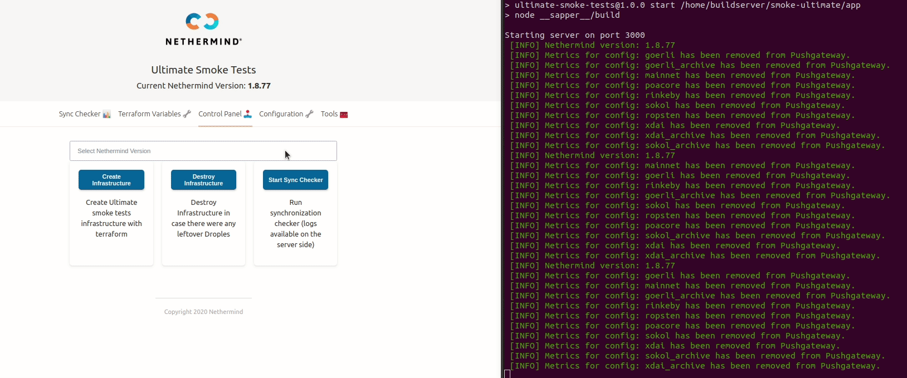

# 冒烟测试示例

## 简介

用于生产的软件版本通常包括整个持续集成/交付流程中的一系列测试和构建步骤。在本文中，我将向您展示如何将不同的监视/基础设施构建工具结合起来使用，以及如何对您的项目进行冒烟测试。请注意，本文只作简要概述，不会涉及具体细节。但是，您可以根据您的项目需要来选择技术堆栈。

冒烟测试所需使用的工具和技术：

* [Terraform](https://www.terraform.io/) \(to design the smoke tests infrastructure\)
* [Terragrunt](https://terragrunt.gruntwork.io/) \(to quickly deploy every module with a single command\)
* [Node.js](https://nodejs.org/en/) \(to build backend scripts for smoke tests management\)
* Bash（为基础设施管理构建的简单脚本）
* [Svelte/Sapper](https://sapper.svelte.dev/) \(to build a handy UI and keep everything in place\)
* [Portainer ](https://www.portainer.io/)\(to manage dockers from a single point\)
* [Pushgateway/Prometheus](https://prometheus.io/)/[Grafana](https://grafana.com/) \(to consume the node's metrics and monitor them\)

就 _Nethermind_ 而言，为了验证我们的应用是否正确运行，我们需要进行的一项核心测试就是同步测试。该测试针对以太坊主网和其它由 _Nethermind_ 支持的[网络](https://docs.nethermind.io/nethermind/ethereum-client/networks)，如，Rinkeby、Ropsten、xDai、Sokol 等。如果您想要访问以太坊网络的当前状态，通常需要同步以太坊节点。在本例中，我将测试默认同步方法 —— `fast sync`（快速同步）。点击[此处](https://docs.nethermind.io/nethermind/ethereum-client/sync-modes#fast-sync)，了解更多相关信息.

## 组件

为了实现这一目标，我们将使用由 _terraform_ 及其包装器 _terragrunt_ 等工具创建的完整基础设施。每个网络都将在独立虚拟机上进行独立测试。这些虚拟机都单独托管在 _DigitalOcean_ 上。DigitalOcean 提供一个非常简单易用的 API。我们会将一切都整合到一个简单的用户界面中，以便管理和监控冒烟测试的状态。

首先，我们将为每个网络创建包含 _terraform_  和 _terragrunt_  文件的文件夹。鉴于您的应用程序可能会采用一些不同的配置，您可能会想在单独的环境中测试应用程序的行为。

```text
module/
├── goerli
│   ├── main.tf
│   ├── terraform.tfvars
│   ├── terragrunt.hcl
│   └── variables.tf
├── goerli_archive
│   ├── main.tf
│   ├── terraform.tfvars
│   ├── terragrunt.hcl
│   └── variables.tf
├── mainnet
│   ├── main.tf
│   ├── terraform.tfvars
│   ├── terragrunt.hcl
│   └── variables.tf
├── poacore
│   ├── main.tf
│   ├── terraform.tfvars
│   ├── terragrunt.hcl
│   └── variables.tf
├── rinkeby
│   ├── main.tf
│   ├── terraform.tfvars
│   ├── terragrunt.hcl
│   └── variables.tf
├── ropsten
│   ├── main.tf
│   ├── terraform.tfvars
│   ├── terragrunt.hcl
│   └── variables.tf
├── sokol
│   ├── main.tf
│   ├── terraform.tfvars
│   ├── terragrunt.hcl
│   └── variables.tf
├── sokol_archive
│   ├── main.tf
│   ├── terraform.tfvars
│   ├── terragrunt.hcl
│   └── variables.tf
├── xdai
│   ├── main.tf
│   ├── terraform.tfvars
│   ├── terragrunt.hcl
│   └── variables.tf
└── xdai_archive
    ├── main.tf
    ├── terraform.tfvars
    ├── terragrunt.hcl
    └── variables.tf
```

在上述每个文件夹的 [`main.tf`](https://gist.github.com/matilote/c1ec9955edc3c2140f6e52eb092376f8) 文件中，我们都描述了 [digitalocean\_droplet](https://registry.terraform.io/providers/digitalocean/digitalocean/latest/docs/resources/droplet) 资源。该资源主要定义了 `name, image, region, size` 和详细的连接信息。这些连接信息将用来建立连接和远程执行虚拟机上的命令。我们还定义了一个在创建时就包含了 droplet IP 地址的输出。该输出将用来查询和验证同步状态。每个文件夹还包含了 [`terragrunt.hcl`](https://gist.github.com/matilote/18e09273b939d87235babd8e63f1d7eb)、[`variables.tf`](https://gist.github.com/matilote/897bbf5ed7bf27e4f1b9dccfb0dbbb40) 和 `terraform.tfvars` 文件。如需了解更多关于如何配置这些文件的信息，请查看以下链接：

* [https://terragrunt.gruntwork.io/docs/getting-started/configuration/](https://terragrunt.gruntwork.io/docs/getting-started/configuration/)
* [https://www.terraform.io/docs/configuration-0-11/variables.html](https://www.terraform.io/docs/configuration-0-11/variables.html)

一旦我们准备好 Terraform 模板，就需要一个脚本来构建整个基础设施，免去手动操作之需。

首先，我们需要在每个模块中设置好 `terraform.tfvars` 文件。我们可以使用以下脚本自动实现，也可以将参数传递给脚本，再由脚本遍历所有模块并将数据写入文件。

```bash
#!/bin/bash
cd module/

for D in *; do
    if [ -d "${D}" ]; then
        cd "${D}/"
        cat > terraform.tfvars <<EOF 
do_token = "$1"
hostname = "$2"
pvt_key = "$3"
ssh_fingerprint = "$4"
gateway = "$5"
EOF
        cd ..
    fi
done
```

接下来，我们可以使用以下脚本。该脚本会遍历每个模块（在本例中，指的是以太坊区块链），并设置一个用来定义即将运行冒烟测试的应用版本的 `TF_VAR_tag` 变量，然后使用 _terragrunt_ 和已经配置好且正在运行中的应用来创建虚拟机。

```bash
#!/bin/bash

echo "Running smoke tests for tag $1"
# Run tests for each instance
cd module/
for D in *; do
    if [ -d "${D}" ]; then
        cd "${D}/"
        sed -i '3s/.*/    TF_VAR_tag = "'"$1"'"/' terragrunt.hcl
        cd ..
    fi
done

# Go back to the main dir
cd ..

# Apply to terraform modules
echo "Y" | terragrunt apply-all

echo "Infrastructure created"
```

如需销毁该基础设施，我们可以使用以下 bash 脚本：

```bash
#!/bin/bash

echo "Finishing smoke tests for tag $1"

echo "Y" | terragrunt destroy-all

echo "Infrastructure destroyed"
```

## 终极冒烟测试应用

该项目的用户界面/后端是使用 _Svelte_/_Sapper_ 设计的。Svelte/Sapper 是一种用来构建网络应用的强大 Javascript 框架。让我们来看一下用户界面。


该应用程序本身是一个简单的单页面应用，包含 5 条路由。其首页是一个简易的面板，显示了每个网络的同步进度。之后，当冒烟测试运行时，我们将看到它是如何变化的。

在第二个标签页中，我们可以设置 terraform 变量。该表格将触发我们之前提到的脚本。该脚本会生成 `terraform.tfvars` 文件。这个脚本只需运行一次，因为数据变化不大。‌

第三个标签页用来管理我们的基础设施、正在运行冒烟测试的当前应用版本，以及我们的应用程序的核心点。该应用程序是运行同步检查器的按钮（会更改状态并更新首页上的面板）。

第四个标签页也是一个表格。该表格中保存的数据可以用来清除 Pushgateway 指标，查询 Etherscan API 以获取当前链首块编号（最新区块编号）以及通往我们在 `terraform.tfvars` 中使用的私钥的路径，因为我们将连接至每个虚拟机，以便在同步完成时或按要求获取日志。

太棒了！我们已经大致介绍了冒烟测试应用的内容。现在，让我们快速了解每个步骤。

基础设施可一键创建，需要使用上文提到的所有 _terraform_ 配置，并准备好运行 _Nethermind_ 节点的 docker 容器。这些节点会被配置成公开 JSON RPC 协议，并将指标推送到我们的 Grafana 面板上，以便我们在同步期间更加细化地控制性能。（点击[此处](https://docs.nethermind.io/nethermind/ethereum-client/metrics/setting-up-local-metrics-infrastracture)，查看更多内容。）



一旦我们的基础设施开始运行，我们就可以启动同步检查器，并查看冒烟测试的进度。同步检查器会运行 _node.js_ 脚本，在 JSON RPC、[Etherscan](https://etherscan.io/) 和 [Blockscout](https://blockscout.com/poa/sokol/) 上进行查询。


同步完成后，则表示冒烟测试完成。日志将被提取到运行该应用的服务器上，虚拟机也会被销毁。相应的状态也将显示在面板上。


在 Tools 标签页上，我们有可能会运行 [_Portainer_](https://www.portainer.io/) _\_docker 实例。通过 \_Portainer_，我们可以管理、停止、重启每台机器上的 docker 容器，甚至实时查看日志。所有这些操作均可使用 Portainer 完成。


一旦所有测试通过，整个基础设施会被自动清理。如有需要，我们可以在服务器端检查日志，并查看 _Grafana_ 面板，以了解该应用在整个测试过程中的表现情况。


如果出现问题并且一条或多条链没有正确同步，我们可以在找到断点后迅速从 Tools 标签页下载日志以便进一步调查，通过控制面板销毁基础设施，并清除 Pushgateway 中的指标日志。

## 总结

您可以通过很多有用的工具来实现快速部署，并在预发布阶段监控您的应用程序。本项目所用工具是我经常使用的不同项目的组合体，例如[这个项目](https://docs.nethermind.io/nethermind/guides-and-helpers/deploy-nethermind-with-monitoring-stack) 。在本例中，我使用 _DigitalOcean_ 作为 _terraform_ 提供商。显然，您也可以选择其它提供商，例如 _UpCloud、Google,_ 或 _AWS_。‌

最具挑战性的事情是设计一个脚本，以正确检查每条链的同步阶段。但是，_node.js_ 和 _Svelte/Sapper_ 起到了重要作用，让我们能够在面板上实时显示同步阶段。如果我们无法看到节点的实时动态，监控效果将大打折扣。这正是监视工具的有用之处。监控工具可以让我们通过网络中的一个节点查看实时日志，并在指定的 _Grafana_ 面板上查看应用性能和同步状态。

用户界面不是必需的，因为这一切都可以通过脚本运行。您可以使用自己熟悉的编程语言来编写脚本。在该项目中，我们还缺少一个良好的警报系统，以便在后端出现问题时，通过 _Slack、_电子邮件、 \_\_甚至电话通知我们。

